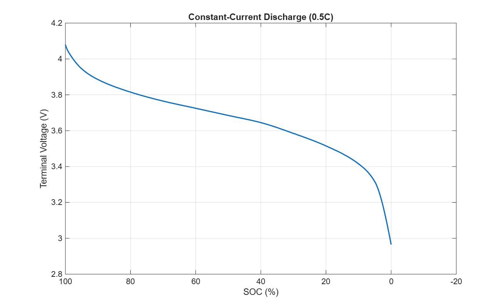
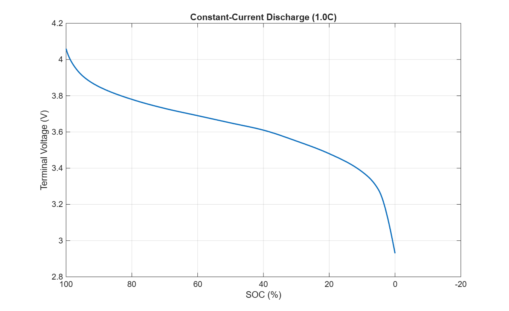
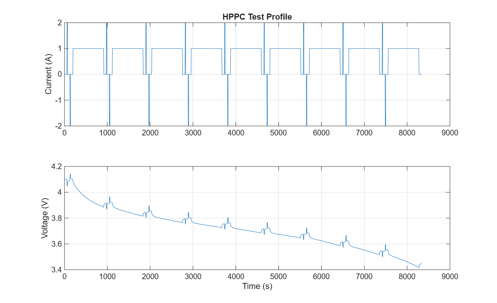
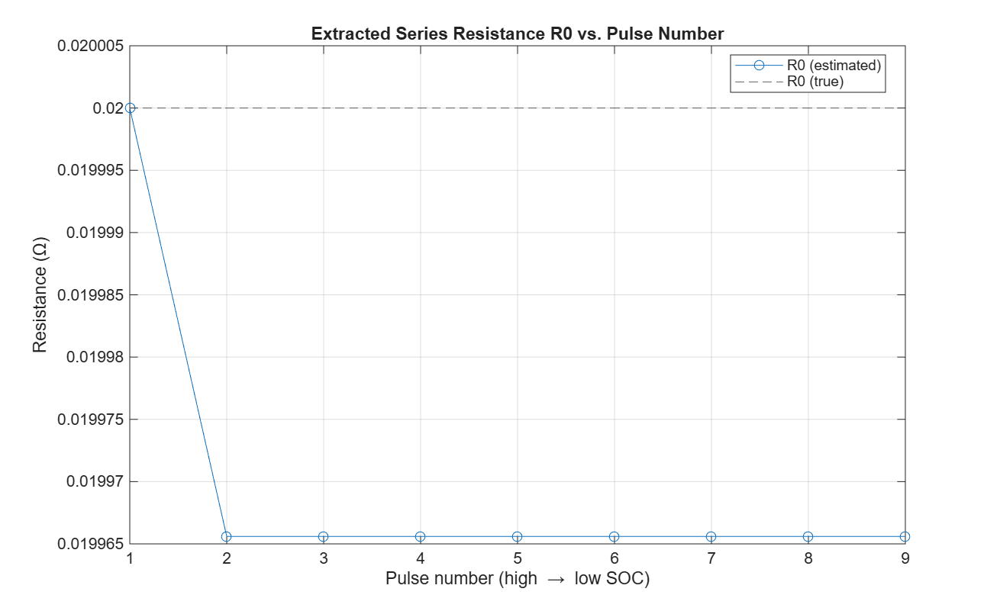
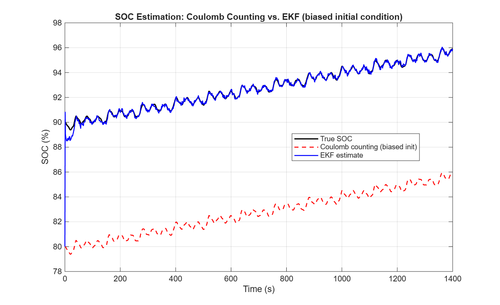

# Li-ion Battery 1RC Thevenin ECM Simulation & SOC Estimation

## 📌 Key Highlights

- **1RC Equivalent Circuit Model (ECM)**: Simulates open-circuit voltage (Voc), internal ohmic resistance (R0), and transient RC diffusion dynamics (R1, C1).
- **Automated Parameter Extraction**: Identifies internal resistance and polarization parameters from HPPC pulse test data.
- **Robust SOC Estimation (EKF)**: Corrects for initial state errors and sensor noise, outperforming standard Coulomb Counting.

---

## 📁 Repository Structure

```text
├── src/
│   ├── simulateBatteryECM.m        # 1RC ECM forward simulation engine
│   ├── generateHPPCProfile.m       # HPPC current profile generator
│   ├── extractECMParameters.m      # Automated R0, R1, C1 parameter extraction
│   ├── generateDriveCycleProfile.m # Dynamic drive-cycle current profile generator
│   ├── ocvSocLookup.m              # Open-circuit voltage vs. SOC relationship
│   └── socEKF.m                    # Extended Kalman Filter implementation
├── results/
│   ├── discharge_curve_0.5C.png    # Constant-current discharge profile (0.5C)
│   ├── discharge_curve_1.0C.png    # Constant-current discharge profile (1.0C)
│   ├── hppc_profile.png            # HPPC current/voltage test curves
│   ├── r0_extraction.png           # Extracted series resistance R0 vs. true value
│   ├── soc_estimation_comparison.png # EKF vs. Coulomb Counting tracking
│   ├── test_output.log             # Simulation console log
│   └── test_results.txt            # Parameter extraction and RMSE logs
├── main_run_all_tests.m            # Main execution test suite
└── README.md
```

---

## 📊 Simulation Results & Analysis

### 1. Constant-Current Discharge
Validates cell terminal voltage drop, internal resistance losses, and lower-cutoff behavior across different discharge rates:

<p align="center">
  
  
</p>

---

### 2. HPPC Test & Parameter Identification
Evaluates dynamic voltage relaxation during current pulses and extracts internal ohmic resistance ($R_0$):

<p align="center">
  
  
</p>

---

### 3. Dynamic Drive-Cycle SOC Estimation (EKF vs. Open-Loop)
Tests estimation performance against measurement noise ($\sigma = 2\text{ mV}$) and an intentional **10% initial SOC bias** ($SOC_0 = 80\%$ estimated vs. $90\%$ true):

<p align="center">
  
</p>

```text


## ⚙️ How It Works (Simplified)

### 1. Battery Modeling (1RC Thevenin Model)
The battery terminal voltage is calculated from three components:

Terminal Voltage (Vt) = Voc(SOC) - V_polarization - (I * R0)

- Voc(SOC): Baseline open-circuit voltage determined by remaining battery charge.
- I * R0: Instantaneous voltage drop across internal ohmic resistance.
- V_polarization: Transient exponential voltage response modeled by a parallel R1-C1 circuit.

### 2. State of Charge Tracking (EKF vs. Coulomb Counting)
- Coulomb Counting (Open-Loop): Integrates current over time. Any initial error or sensor drift remains permanently uncorrected.
- Extended Kalman Filter (Closed-Loop): Continuously compares predicted terminal voltage with sensor measurements to dynamically correct SOC errors.

## 📊 Results & Validation

### Parameter Extraction
- **Nominal $R_0$**: `0.0200 Ω` | **Extracted $R_0$**: `0.0200 Ω` (0.00% Error)
- **Nominal $R_1$**: `0.0150 Ω` | **Nominal $C_1$**: `2000.0 F` ($\tau = 30.0\text{ s}$)

### SOC Estimation Performance (Dynamic Drive Cycle)
Tested with **2 mV sensor noise** and an intentional **10% initial offset** ($\text{SOC}_0 = 80\%$ estimated vs. $90\%$ true):

| Method | Initial Bias | Final RMSE | Convergence Time |
|---|---|---|---|
| **Coulomb Counting** | 10.0% | **10.00%** | Never recovers |
| **Extended Kalman Filter (EKF)** | 10.0% | **0.45%** | **< 60 seconds** |

---

## 🚀 Getting Started

### Prerequisites
- MATLAB R2020b or later

### Running the Project
1. Clone the repository:
   ```bash
   git clone [https://github.com/Kushal-V26/proov-km-waechter-fix.git](https://github.com/Kushal-V26/proov-km-waechter-fix.git)
   cd proov-km-waechter-fix
   ```
2. Open MATLAB and run:
   ```matlab
   main_run_all_tests
   ```
3. All plots and log files will automatically save to the `results/` folder.

---

## 📄 License
Distributed under the MIT License.

---


   ```
4. All generated figures, diagnostic output, and test metrics will update directly in the `/results` directory.
